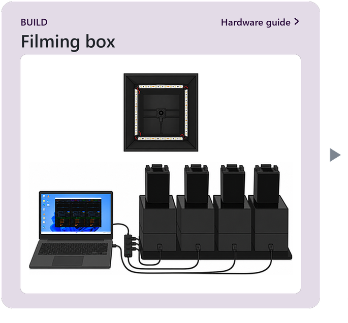
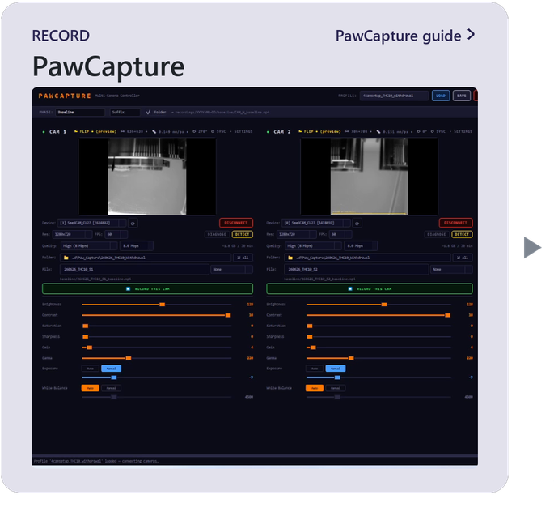
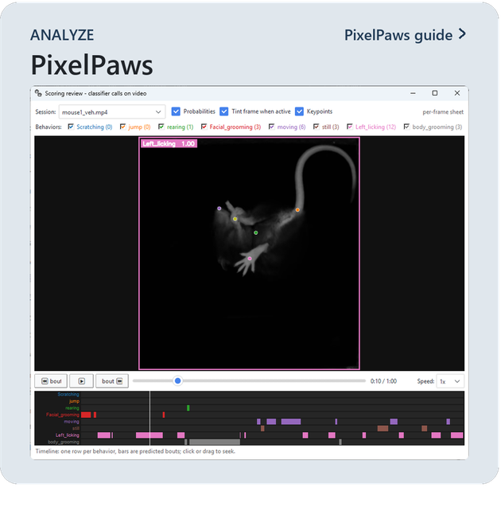
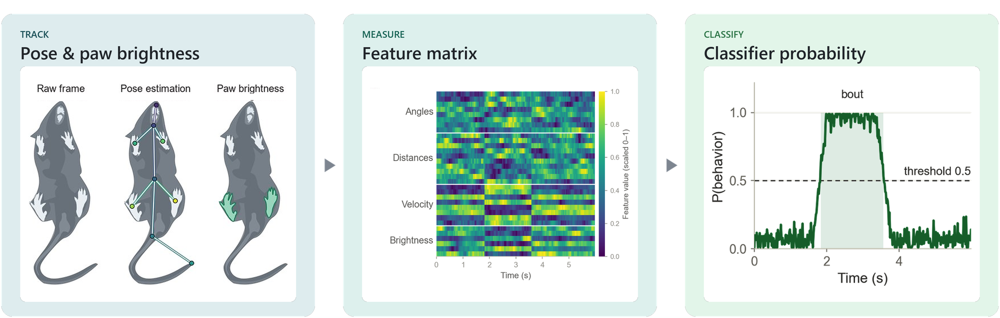
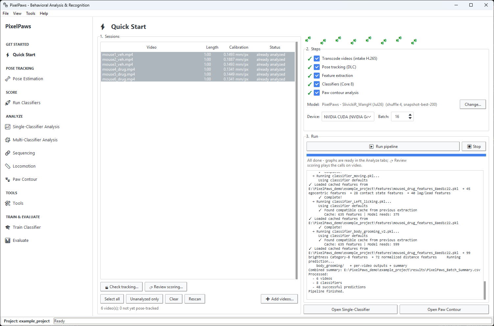

# PixelPaws

PixelPaws scores mouse behavior from video filmed from below: a low-cost filming box, multi-camera recording software, and an analysis GUI that turns each video into per-frame behavior calls, group statistics and figures. It ships with a DeepLabCut pose network and validated classifiers (licking, scratching, grooming, rearing, jumping, moving and stillness) trained on this filming box, so labs that build it can score pain, itch and withdrawal experiments without labeling or training anything.

**Paper:** Slivicki RA, Wang H, Mwirigi JM, Kucz K, Hua H, Creed MC, Gereau RW. *PixelPaws: a low-cost, open-source integrated platform for automated scoring of mouse behaviors.* bioRxiv (2026). [doi:10.64898/2026.09.19.752787](https://doi.org/10.64898/2026.09.19.752787)

## Overview

  
  

Click **Build**, **Record** or **Analyze** to open that guide. The bottom row is what the analysis does with each video.

## Demo

Scratching classifier output overlaid on the video, frame by frame (click to expand)

<video src="https://github.com/user-attachments/assets/e0a584de-79b6-440f-a04d-0090ccbda179" controls width="720"></video>

## PixelPaws Suite

### The build

Each mouse sits on a clear acrylic floor inside a 3D-printed box, lit by 850 nm infrared LEDs and filmed from below by a See3CAM_CU27 camera. The [hardware guide](docs/hardware.md) has the parts list, STL files and wiring notes.

### Video capture

PawCapture records several boxes at once (we have tested up to four), with per-camera crop, camera settings and a two-click mm-per-pixel calibration that PixelPaws reads from each file. The [PawCapture guide](pawcapture/README.md) walks through a session, with a video. You do not have to use it. PixelPaws takes video from any recording software.

### Analysis

PixelPaws tracks pose with a bundled DeepLabCut network, computes pose and paw-brightness features for every frame, and scores eight behaviors with validated classifiers. It then compares groups (time courses, bouts, sequences, locomotion, paw contour) and can train new classifiers. See the [PixelPaws guide](docs/pixelpaws.md).

## Installation

Windows 10 or 11 (64-bit). Right-click each downloaded zip and choose **Extract All** first. Nothing runs from inside a zip. If Windows says "Windows protected your PC", click **More info**, then **Run anyway** (the apps are not code-signed).

| | You need | Get it |
| --- | --- | --- |
| **1. PawCapture** (recording, optional) | One or more See3CAM_CU27 cameras on USB 3.0 ports (tested with up to 4). Nothing else to install. | **[Download PawCapture 0.8.0](https://github.com/rslivicki/PixelPaws/releases/download/v0.9.0/PawCapture-0.8.0_win64.zip)** · [guide](pawcapture/README.md#install) · [video](https://youtu.be/XVCIXMrne3o) |
| **2. PixelPaws** (analysis) | About 6 GB of disk, and internet for the first install. An NVIDIA GPU makes pose tracking about 25 times faster, but CPU works. | **[Download the installer](https://github.com/rslivicki/PixelPaws/releases/download/v0.9.0/PixelPaws_v0.9.0_win64.zip)** · [install steps](docs/pixelpaws.md#installation) · [from source](docs/pixelpaws.md#running-from-source) |

All versions are on the [Releases page](https://github.com/rslivicki/PixelPaws/releases).

## Quick Start

**First time?** [Your first run](docs/first_run.md) walks through the example project that installs with PixelPaws, with a screenshot of every step. It takes about 10 minutes.

1. **Install and launch** ([Installation](#installation)). In the Project Setup window click **New Project**, pick a folder, then **Use defaults and finish**.
2. **Add videos** on the **Quick Start** tab and press **Run pipeline**. It transcodes, tracks pose, extracts features, runs the eight bundled classifiers (the Core 8) and analyzes paw contours. Steps that are not needed are skipped.
3. **Check the work** before you trust the numbers. 🎬 **Check tracking** plays a video with the keypoints drawn on it. 🏷 **Review scoring** plays it with the behavior calls.
4. **Compare groups.** Put a key file (a CSV with `Subject` and `Treatment` columns) in the project folder, or let PixelPaws make one when the run finishes. The Analyze tabs fill in from it: Single-Classifier, Multi-Classifier, Sequencing, Locomotion and Paw Contour.

Good to know:

- **File names.** Put underscores between the parts (`mouse1_veh.mp4`, `m07_sni_day3.mp4`), no spaces or hyphens. Subjects match whole parts, so `mouse1` in the key file finds `mouse1_veh` but not `mouse10_veh`.
- **Licking is the left hind paw,** the injected side in our assays. For the right paw, mirror the videos or account for it in your analysis.
- **One behavior per frame.** Where two classifiers fire together, the higher priority keeps the frame (licking, scratching, jumping, rearing, body grooming, facial grooming, moving, still), so the behaviors' times add up.
- **Other behaviors.** You only need the Train Classifier tab (and BORIS labels) for behaviors the Core 8 does not cover. See [Training your own classifiers](docs/training.md).

## Getting help

- The [PixelPaws guide](docs/pixelpaws.md) covers every tab. `INSTALL.txt` in the download lists install problems and fixes.
- Still stuck? [Open an issue](https://github.com/rslivicki/PixelPaws/issues) saying what you did and what happened, and attach `%LOCALAPPDATA%\PixelPaws\run.log` (paste that path into File Explorer's address bar to find it).
- [Updating](docs/pixelpaws.md#updating) · [Uninstalling](docs/pixelpaws.md#uninstalling)

## Citation

If you use PixelPaws or PawCapture, please cite:

> Slivicki RA, Wang H, Mwirigi JM, Kucz K, Hua H, Creed MC, Gereau RW. PixelPaws: a low-cost, open-source integrated platform for automated scoring of mouse behaviors. *bioRxiv* (2026). [doi:10.64898/2026.09.19.752787](https://doi.org/10.64898/2026.09.19.752787)

## Attribution and license

The paw-brightness features and the classifier training approach follow [BAREfoot](https://github.com/OmerBarkai/BAREfoot):

> Barkai O, Zhang B, Turnes BL, et al. A machine learning tool with light-based image analysis for automatic classification of 3D pain behaviors. *Cell Reports Methods* 5, 101145 (2025). [doi:10.1016/j.crmeth.2025.101145](https://doi.org/10.1016/j.crmeth.2025.101145)

Pose estimation uses [DeepLabCut](https://github.com/DeepLabCut/DeepLabCut):

> Mathis A, Mamidanna P, Cury KM, et al. DeepLabCut: markerless pose estimation of user-defined body parts with deep learning. *Nature Neuroscience* 21, 1281-1289 (2018). [doi:10.1038/s41593-018-0209-y](https://doi.org/10.1038/s41593-018-0209-y)
>
> Lauer J, Zhou M, Ye S, et al. Multi-animal pose estimation, identification and tracking with DeepLabCut. *Nature Methods* 19, 496-504 (2022). [doi:10.1038/s41592-022-01443-0](https://doi.org/10.1038/s41592-022-01443-0)

[CC BY-NC 4.0](https://creativecommons.org/licenses/by-nc/4.0/). Free for academic and non-commercial use.

© 2026 rslivicki
