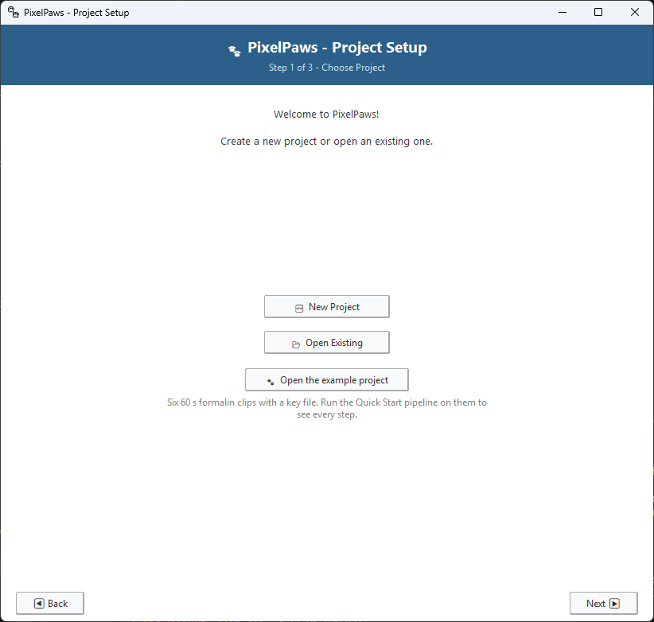
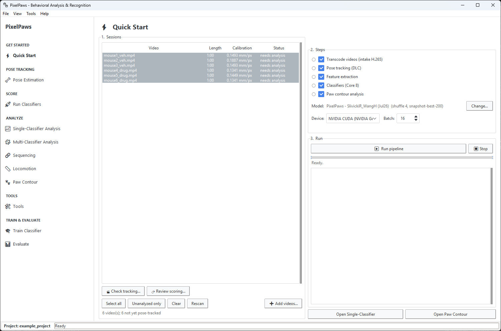
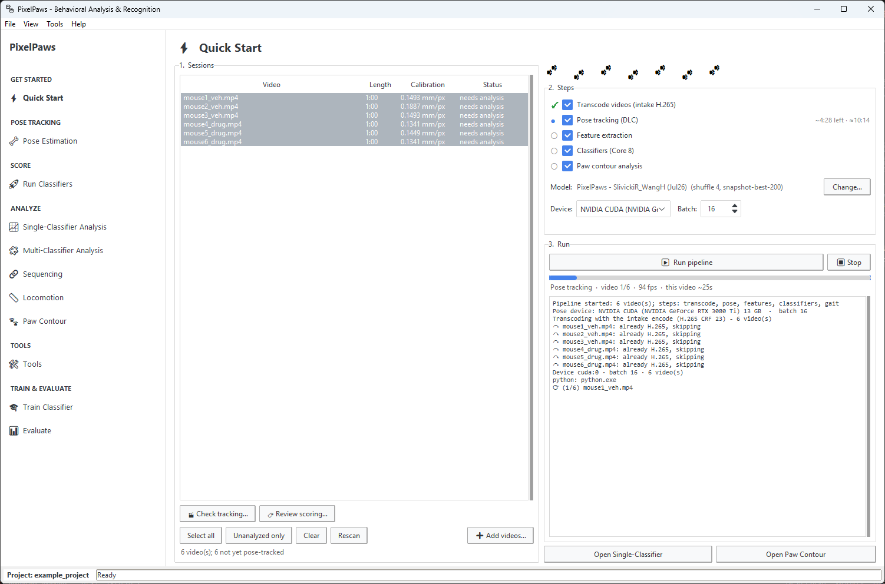

# Your first run

A tour of PixelPaws using the example project that installs with it: six 60-second formalin clips, three from vehicle mice and three from mice given a drug. It takes about 10 minutes, most of it waiting, and needs no programming. [Install PixelPaws](../README.md#installation) first.

Words you may not know are explained in the [PixelPaws guide](pixelpaws.md#words-used-in-this-guide).

## 1. Open the example project

Start PixelPaws from the desktop shortcut. The **Project Setup** window opens (it opens every time PixelPaws starts). Click **Open the example project**.

## 2. Check the six clips

The main window opens on the **Quick Start** tab. The table lists the six videos, each 1:00 long, with their camera calibration (mm per pixel) and the status **needs analysis**. All six are selected, and all five steps on the right are ticked. Leave them that way.

## 3. Run the pipeline

Click **Run pipeline**. The steps run in order, and the dot next to each one fills in as it starts:

1. **Transcode** shrinks the videos. The example clips are already in the small format, so the log says *already H.265, skipping*.
2. **Pose tracking** finds the paws, snout, tail and body in every frame. This is the slow step: under a minute per clip on an NVIDIA GPU, several minutes per clip on a CPU.
3. **Feature extraction**, **Classifiers** and **Paw contour analysis** follow on their own.

The bar and the log show where it is, and each step shows its time left. Leave the window open.

When it finishes, every step has a green tick, each clip says **already analyzed**, and the line under the bar says *All done*. On our computer (one NVIDIA RTX 3080 Ti) the whole run took a little over 5 minutes.

## 4. Look at the calls on the video

Always check what the software saw before trusting the numbers. Click **🏷 Review scoring…** under the table and pick **mouse1_veh.mp4**. Tick **Keypoints** to see the tracking too.

- The colored label in the corner names the behavior happening on this frame and the classifier's confidence (0 to 1).
- The dots are the tracked body parts. They should sit on the paws, snout and tail.
- The timeline at the bottom has one row per behavior, and each bar is one bout. Click anywhere on it to jump there. **⏮ bout** and **bout ⏭** jump between bouts.

The vehicle mice lick their injected paw a lot in this part of the formalin test. The drug-treated mice hardly lick at all. **🎬 Check tracking…** shows the keypoints alone, if you want to look at tracking before anything is scored.

## 5. Compare the groups

Click **Single-Classifier Analysis** in the sidebar. The example's key file (`key.csv`) puts mouse1 to mouse3 in **Vehicle** and mouse4 to mouse6 in **Drug**, so the graphs are already split by group. Set **Graph** to **Total Time** and **Behavior** to **Left_licking**.

You should see roughly 13 seconds of licking per vehicle mouse and none for the drug-treated mice. Each dot is one mouse. Three mice per group is enough to show the graphs, not to test an effect. Tick **Enable statistics** when you have real groups.

## 6. Paw contour

Click **Paw Contour** in the sidebar. It opens on the **contact intensity ratio**: how bright the injected (left) hind paw looks on the floor, divided by the other hind paw. Below 1.0 means the injected paw appears less intense, which may indicate less contact with the floor.

Both groups come out below 1.0 (vehicle about 0.87, drug about 0.89), so the injected paw appears less intense in both. In these clips the groups differ in licking but not in the intensity ratio, which is why it pays to look at more than one measure. The **Graph** list has the area, circularity and solidity ratios next. The per-paw measures are in the other categories.

Licking frames are left out of the contour analysis automatically, because a paw held up to the mouth still looks like a paw on the floor. That is why licking has to be scored first. The Quick Start pipeline does that for you.

## Next: your own videos

1. **Make a project.** Close PixelPaws and start it again (or **File → Load Project…**), click **New Project** and pick an empty folder. Then click **Use defaults and finish**.
2. **Add your videos** on the Quick Start tab with **➕ Add videos…**. Name them with underscores between the parts, for example `m07_sni_day3.mp4`, and no spaces or hyphens.
3. **Run the pipeline** as above.
4. **Tell PixelPaws the groups.** When the run finishes without a key file, PixelPaws offers to make one. A table lists each video, you type its group (for example Vehicle or Drug) and click **💾 Save**. **Tools → Key File (Group Assignment)…** does the same at any time.

The bundled pose network and classifiers were trained on video from the PixelPaws filming box, filmed from below at 60 frames per second. Videos from another setup need their own network and classifiers. See [Training your own classifiers](training.md).

Stuck? See [Getting help](../README.md#getting-help).
