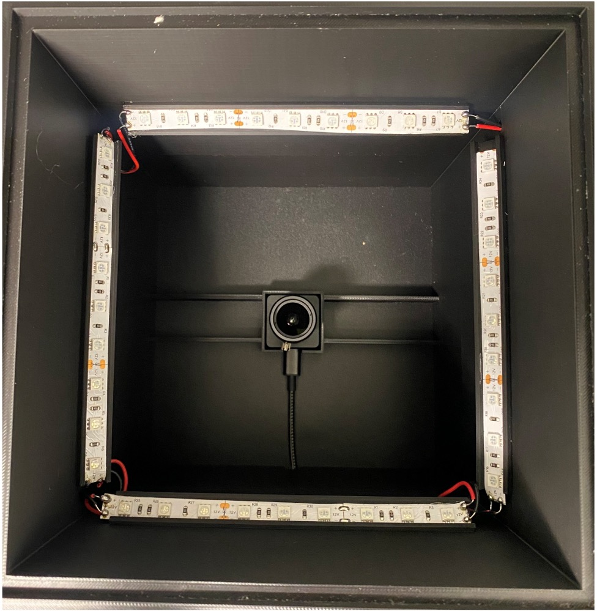
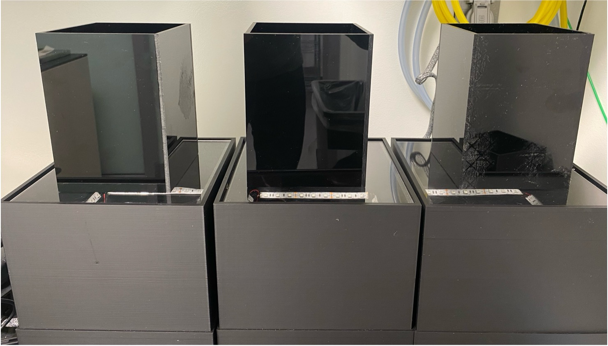
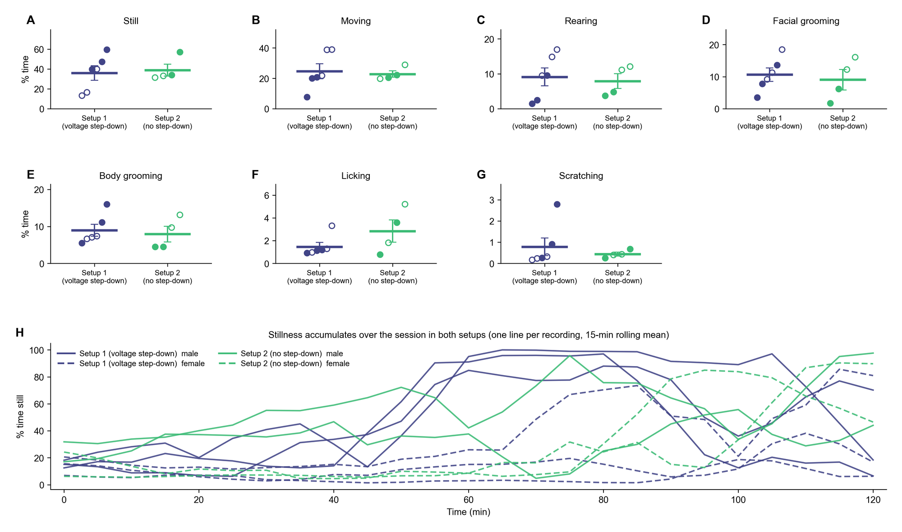

# PixelPaws Hardware

This document describes all hardware components used in the PixelPaws filming enclosure, including cameras, lenses, lighting, power supplies, acrylic panels, and 3D printing materials. It covers the build only. For the recording computer, USB setup and the recording software, see the [PawCapture guide](../pawcapture/README.md#requirements).

---

## 🏁 Final Build

| Interior (camera + LED strips) | Fully assembled enclosures |
| --- | --- |
|  |  |

---

## 📦 Bill of Materials

| Component | Manufacturer | Model / Part Number | Key Specs | Link |
| --- | --- | --- | --- | --- |
| **Camera** | e-con Systems | `See3CAM_CU27` · SKU: `CHLCC_BX_H02R1` | Sony STARVIS IMX462 sensor · Full HD (1080p) · USB 3.1 Gen 1 (USB-C) · 100 fps MJPEG / 60 fps UYVY · 0 lux low-light · M12 lens mount · UVC compliant (no drivers) · 5V, max 2.12W | [Product Page](https://www.e-consystems.com/usb-cameras/sony-starvis-imx462-ultra-low-light-camera.asp) |
| **Lens** | Marshall Electronics | `CV-2812-3MP` | M12 (S-mount) · 2.8–12 mm varifocal · f/1.4 · 3 MP · IR corrected · 109°–31.2° horizontal FOV · 1/2.7" sensor format · Manual focus + zoom with lock screws | [B&H Product Page](https://www.bhphotovideo.com/c/product/1428706-REG/marshall_electronics_cv_2812_3mp_m12_2_8_12mm_f_1_4_3mp.html) |
| **LED Strip (IR)** | generic | SMD5050 850 nm IR strip | 850 nm infrared · SMD 5050 tri-chip · 12V DC · 60 LEDs/m · 14.4 W/m · 120° beam angle · Non-waterproof (IP20) · 3-LED cuttable · 5 m/roll · 50,000 hr lifespan | [Amazon](https://www.amazon.com/dp/B0FC2GJTR4) |
| **LED Power Supply** | inShareplus | 12V 2A switching adapter for LED strips (one per box) | Input: 100–240V AC · Output: 12V DC @ 2A · 24W max · 5.5/2.1 mm DC barrel plug, with a barrel-to-screw-terminal adapter included · Non-dimmable | [Amazon](https://www.amazon.com/dp/B01GD4ZQRS) |
| **Voltage step-down (optional)** | DROK | Adjustable step-down module (DC buck converter) | Input: 5.3–32V DC · Output: 1.2–32V adjustable, set to 5V · 12A · LCD readout · Sits between the 12V adapter and the LED strip so the strip does not warm the floor. See [Voltage step-down on the LED strip](#voltage-step-down-on-the-led-strip-optional) | [Amazon](https://www.amazon.com/dp/B078Q1624B) |
| **Acrylic Sheet (Colored)** | TAP Plastics | Chemcast Cast Acrylic, Color | 110 mm width · 4 sheets per order · Box sides only (tops are 3D printed) · Cut-to-size · Glossy finish · UV stable | [TAP Plastics](https://www.tapplastics.com/product/plastics/cut_to_size_plastic/acrylic_sheets_color/341) |
| **Acrylic Sheet (Clear Cast)** | TAP Plastics | Chemcast Cast Acrylic, Clear | 189 mm width · 1 sheet per order · Cut-to-size · Optical clarity · UV stable · Non-yellowing | [TAP Plastics](https://www.tapplastics.com/product/plastics/cut_to_size_plastic/acrylic_sheets_cast_clear/510) |
| **3D Printer Filament** | eSUN | PLA+ 1.75 mm, Black | 1.75 mm diameter · Black · 1 kg (2.2 lbs) spool · PLA+ formulation | [Amazon](https://www.amazon.com/eSUN-1-75mm-Printer-Filament-2-2lbs/dp/B01EKEMDA6/) |

---

## 🪟 Acrylic Panels

Acrylic sheets are ordered cut-to-size from [TAP Plastics](https://www.tapplastics.com). Cut tolerance is ±1/32". Cut-to-size orders typically ship within 1–2 business days.

### Colored Acrylic (Box Sides)

- **Source:** [TAP Plastics: Acrylic Sheets Color](https://www.tapplastics.com/product/plastics/cut_to_size_plastic/acrylic_sheets_color/341)
- **Material:** Chemcast® Cast Acrylic (opaque/translucent color options)
- **Width:** 110 mm
- **Quantity:** 4 sheets per box
- **Notes:** Box sides only. The filming box top and mouse chamber top are both 3D printed. See [3D Printed Enclosure](#️-3d-printed-enclosure) section below.

### Clear Cast Acrylic (Viewing Panel)

- **Source:** [TAP Plastics: Cast Clear Acrylic](https://www.tapplastics.com/product/plastics/cut_to_size_plastic/acrylic_sheets_cast_clear/510)
- **Material:** Chemcast® Cell Cast Clear Acrylic
- **Width:** 189 mm
- **Quantity:** 1 sheet per box
- **Notes:** Optical clarity with 92% light transmission. UV stable and non-yellowing.

---

## 🖨️ 3D Printed Enclosure

The filming box consists of 3D-printed parts. STL files are in [`hardware/stl/`](../hardware/stl).

| File | Description |
| --- | --- |
| `Bottom_Chamber_with_Camera_holder.stl` | Lower chamber housing the camera module and LED strips |
| `Top_of_filming_box_LED_8cm_from_bottom.stl` | Top lid of the filming enclosure with integrated LED mount positioned 8 cm from the bottom. **Current recommended top** |
| `Mouse_box_top.stl` | Top of the mouse chamber (3D-printed replacement for the acrylic panel top) |

> **Recommended print settings:** Use eSUN PLA+ 1.75 mm Black filament · 0.2 mm layer height · 20–30% infill · Supports as needed for camera holder geometry.

> **Filament:** [eSUN PLA+ 1.75 mm Black, Amazon](https://www.amazon.com/eSUN-1-75mm-Printer-Filament-2-2lbs/dp/B01EKEMDA6/)

---

## ⚡ Wiring Notes

* The LED strips are rated for **12V DC**. Connect them to the included 5.5/2.1 mm barrel adapter from the power supply, or through a buck converter at 5V so they do not warm the floor (see [below](#voltage-step-down-on-the-led-strip-optional)).
* The camera connects to the host via **USB-C (USB 3.1 Gen 1)**. USB 2.0 backward compatible.
* Do **not** connect LED strips directly to AC mains. Always use the 12V adapter.
* LED strips are cuttable every **3 LEDs (~50 mm)**. Cut only along marked cut lines.
* The 850 nm IR LEDs emit **invisible light**. Do not use for visible accent lighting.

### Soldering LED Strip Segments

LED strips are sold in rolls and must be cut to length along the marked cut lines. To form the enclosure lighting layout you will need to solder cut segments back together.

1. **Match polarity.** Each cut point exposes solder pads marked `+` and `−`. Always connect `+` to `+` and `−` to `−` across segments.
2. **Bridge with short wires.** Use 2–4 cm lengths of **22 AWG silicone-jacketed wire** to connect segments at corners or across gaps in the enclosure frame.
3. **Tin first.** Apply a small bead of solder to each pad and to each wire end before joining them. This makes the final joint faster and cleaner.
4. **Solder type.** Use **lead-free rosin-core solder** (e.g., Sn99.3/Cu0.7, 0.8 mm diameter).

> **Tip:** A pair of helping-hands clips or a small vise makes it much easier to hold strip segments flat while soldering.

### Voltage step-down on the LED strip (optional)

Run straight from the 12V adapter, the current-limiting resistors on the LED strip warm the chamber floor. A DC buck converter (we use a DROK adjustable step-down module: 5.3 to 32V input, 1.2 to 32V output, 12A, with an LCD readout) placed between the adapter and the strip fixes this. We set its output to **5V**. The LEDs are dimmer at 5V, so raise the camera's exposure in PawCapture to get the same picture.

| | Setup 1 | Setup 2 |
| --- | --- | --- |
| LED strip power | 12V adapter, then buck converter set to 5V, then strip | 12V adapter straight to the strip |
| Floor warming | No | Yes |
| Camera exposure | Raised to make up for the dimmer LEDs | Default |

Wiring: adapter `+` and `−` to the converter's input terminals, the converter's output terminals to the strip's `+` and `−` pads. Set the output to 5V on the converter's LCD readout before you connect the strip.

**Does it change the scoring?** Not in our hands. We recorded ten naive mice, six with the step-down and four without, and no behavior differed between the two setups (Mann-Whitney test, p = 0.35 to 1.00). Even so, we recommend testing this on your own setup before you rely on it.

*Percent of the session spent in each behavior (A to G) and the stillness time course of each recording over 120 min (H). Filled symbols are males, open symbols females. Bars are group means with SEM. Six recordings in Setup 1 and four in Setup 2. This is Figure S2 of the paper.*

---

## 📐 Camera Specifications (Detail)

| Parameter | Value |
| --- | --- |
| Sensor | Sony STARVIS IMX462LQR |
| Optical Format | 1/2.8″ |
| Resolution | 1937 × 1097 (Full HD) |
| Pixel Size | 2.9 µm × 2.9 µm |
| Shutter | Electronic Rolling Shutter |
| Frame Rate | MJPEG: 100 fps @ 1080p · UYVY: 60 fps @ 1080p |
| Lens Mount | M12 (S-mount) |
| Interface | USB 3.1 Gen 1, Type-C connector |
| OS Support | Windows, Linux, Android\*, macOS\*\* |
| Operating Voltage | 5V ± 5% |
| Power | Max 2.12W / Min 0.85W |
| Operating Temp | −30°C to 60°C |

---

## 🔭 Lens Specifications (Detail)

| Parameter | Value |
| --- | --- |
| Mount | M12 (S-mount) |
| Focal Length | 2.8–12 mm (varifocal) |
| Aperture | f/1.4 (fixed iris) |
| Sensor Compatibility | 1/2.7″, 3 MP |
| Horizontal FOV | 109° (wide) – 31.2° (tele) |
| Back Focal Length | 6.9–14.4 mm |
| IR Correction | Yes |
| Focus / Zoom | Manual with lock screws |
