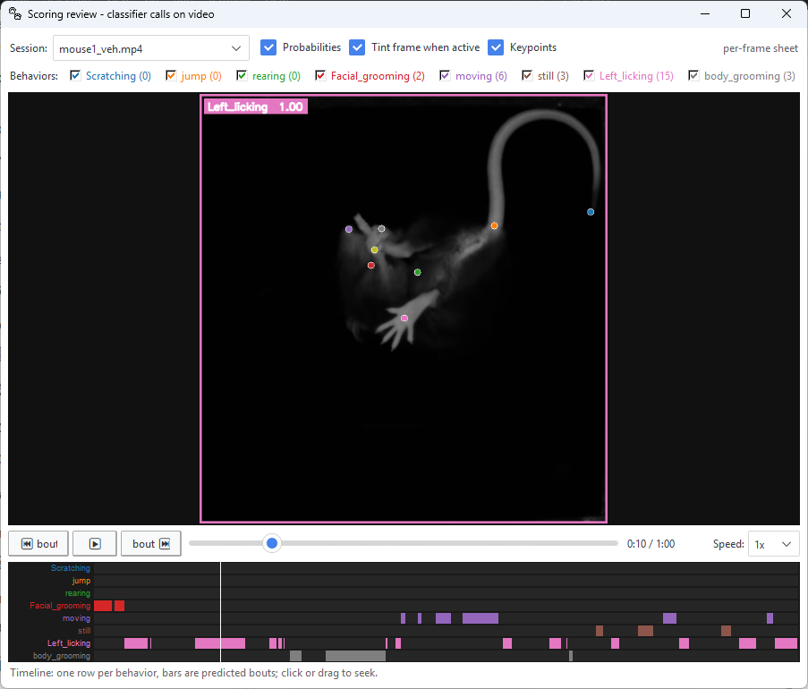
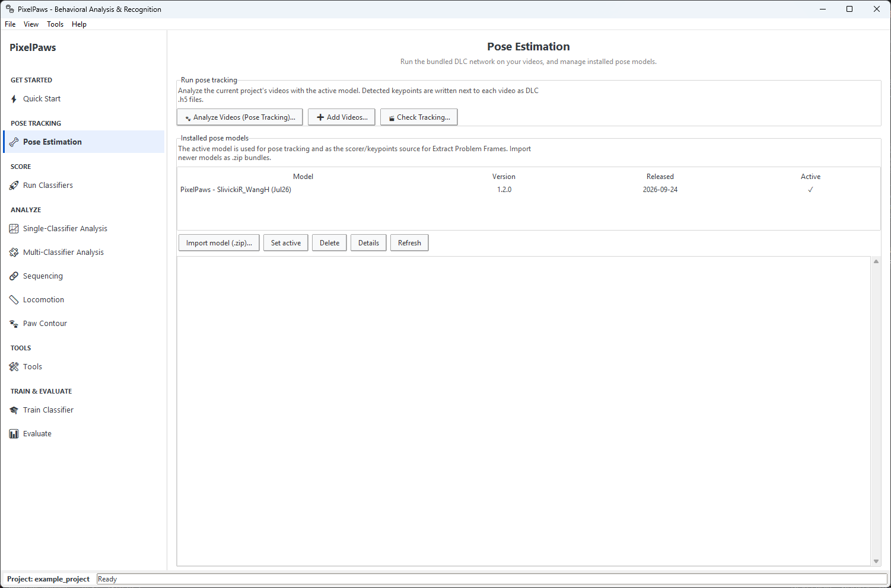
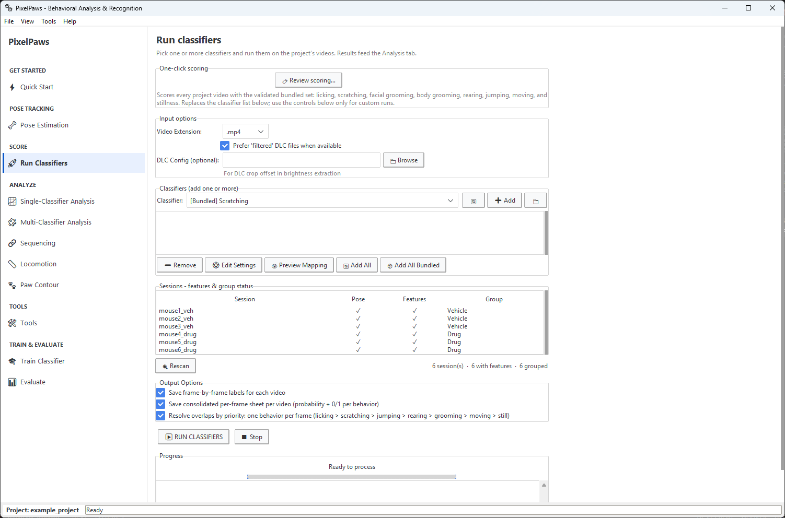
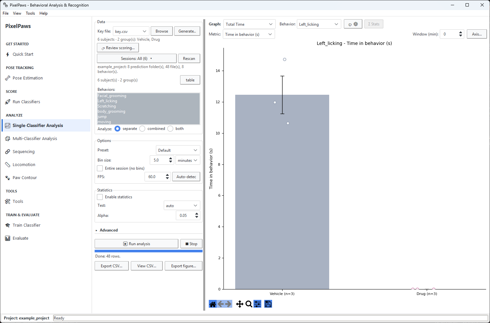
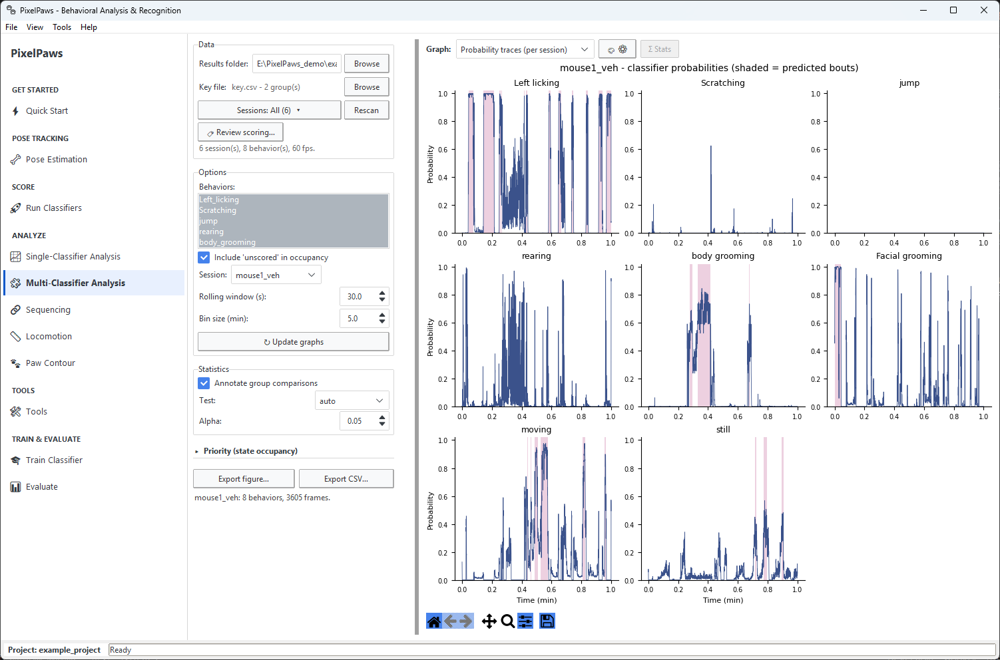
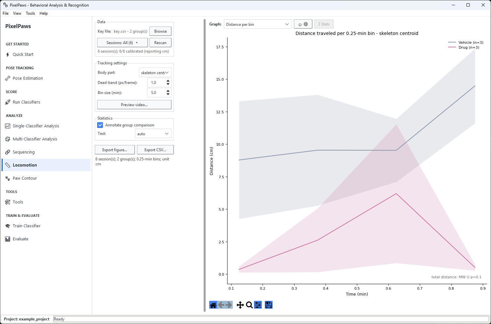
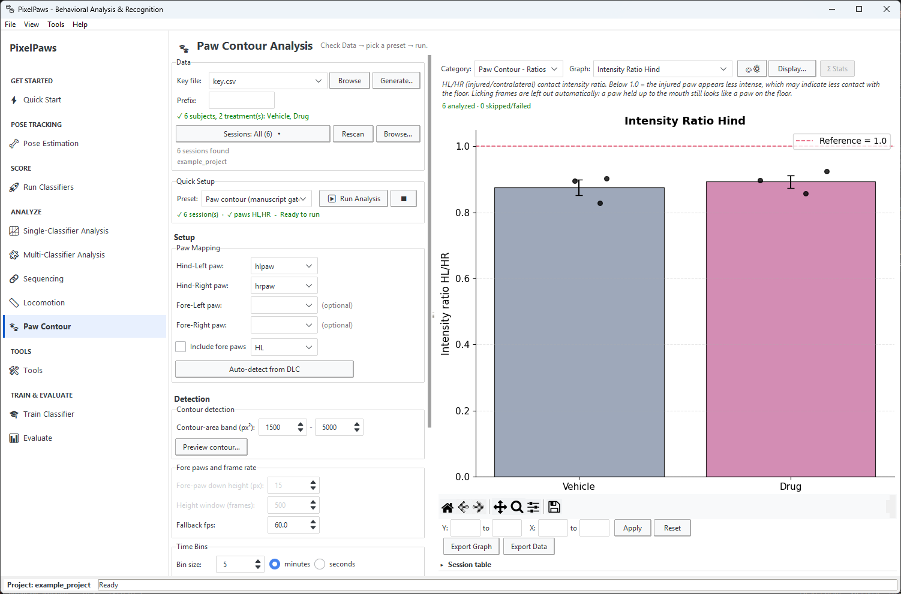
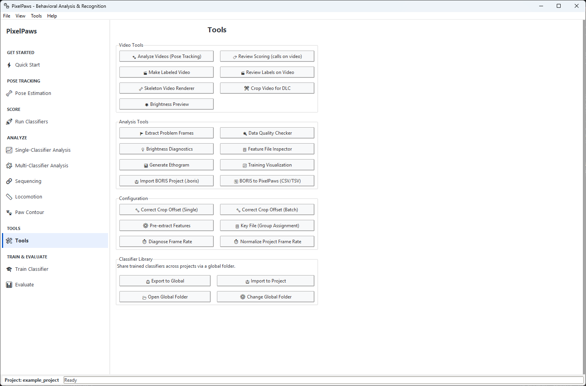

# PixelPaws guide

Everything about using PixelPaws after it is installed: preparing data, every tab, labeling, and training your own classifiers. For an overview and the four-step Quick Start, see the [main page](../README.md). For recording with the filming box, see the [PawCapture guide](../pawcapture/README.md).

## Contents

1. [Installation](#installation)
   - [Updating](#updating)
   - [Uninstalling](#uninstalling)
   - [Running from source](#running-from-source)
2. [Recording videos](#recording-videos)
3. [Project Setup Wizard](#project-setup-wizard)
   - [Project folder layout](#project-folder-layout)
4. [Preparing your data](#preparing-your-data)
5. [Tab-by-tab guide](#tab-by-tab-guide)
   - [Quick Start](#quick-start-tab)
   - [Pose Estimation](#pose-estimation-tab)
   - [Run Classifiers](#run-classifiers-tab)
   - [Choosing which sessions to analyze](#choosing-which-sessions-to-analyze)
   - [Single-Classifier Analysis](#single-classifier-analysis-tab)
   - [Multi-Classifier Analysis](#multi-classifier-analysis-tab)
   - [Sequencing](#sequencing-tab)
   - [Locomotion](#locomotion-tab)
   - [Paw Contour](#paw-contour-tab)
   - [Tools](#tools-tab-and-tools-menu)
   - [Train Classifier](#train-classifier-tab)
   - [Evaluate](#evaluate-tab)
6. [Requirements](#requirements)

[Training your own classifiers](training.md) (labels, BORIS, Train, Evaluate, Crop for DLC) is a separate page.

[Words used in this guide](#words-used-in-this-guide)

**Just scoring videos with the bundled classifiers?** You need [Installation](#installation), the [Quick Start tab](#quick-start-tab) and the Analyze tabs. Building your own classifiers (labels, BORIS, the Train and Evaluate tabs) is on [its own page](training.md).

---

## Words used in this guide

| Word | Meaning |
|---|---|
| Session | One video of one animal. |
| Pose estimation, keypoints | Finding body parts (paws, snout, tail base and so on) in every frame. PixelPaws uses DeepLabCut (DLC) for this. |
| `.h5` file | The file DeepLabCut writes next to each video, with every keypoint's position in every frame. |
| Features | Numbers PixelPaws computes for every frame from the keypoints and the paw brightness: distances, angles, speeds and so on. Classifiers read these. |
| Classifier | A trained model (a `.pkl` file) that decides, frame by frame, whether one behavior is happening. The Core 8 are the ones that ship with PixelPaws. |
| Probability, threshold | A classifier's 0 to 1 score for each frame. Frames above the threshold count as the behavior. |
| Bout | An unbroken run of frames scored as one behavior. Bout filters drop runs that are too short and join runs separated by a short gap. |
| Key file | A CSV that says which group each animal is in (`Subject` and `Treatment` columns). PixelPaws can make one for you. |
| Per-frame sheet | A CSV with every behavior's call for every frame of a session, in `results/per_frame/`. |
| Labels | Your own frame-by-frame scoring of a behavior (usually from BORIS), used to train or check a classifier. |
| Transcode | Re-saving a video in a smaller format (H.265). The picture does not change in any way that matters to the analysis. |
| Calibration, mm/pixel | How many millimeters one pixel covers, set in PawCapture, so distances come out in real units. |
| conda environment, CUDA | The self-contained Python setup the installer builds, and NVIDIA's GPU library. The installer handles both. You never touch them. |

---

## Installation

1. Download the installer zip: **[PixelPaws_v0.9.0_win64.zip](https://github.com/rslivicki/PixelPaws/releases/download/v0.9.0/PixelPaws_v0.9.0_win64.zip)** (about 120 MB). All versions are on the [Releases page](https://github.com/rslivicki/PixelPaws/releases). Right-click it and choose **Extract All** (the installer does not work if you run it from inside the zip).
2. Double-click **`Install PixelPaws.bat`** in the extracted folder. If Windows says "Windows protected your PC", click **More info**, then **Run anyway** (the installer is not code-signed).
   - It asks where to install (default `C:\Users\<you>\PixelPaws`), and where to put Miniforge if you have no conda.
   - It builds a `pixelpaws` conda environment (PyTorch, CUDA, DeepLabCut and the rest), copies the pose model to `%LOCALAPPDATA%\PixelPaws\bundles\`, and offers a desktop shortcut.
   - The first install downloads a few GB and takes 10 to 20 minutes. Leave the window open until it says it is done.
3. Launch from the desktop shortcut or `Run PixelPaws.bat`.

You need Windows 10 or 11 (64-bit), about 6 GB of disk, and internet for the first install. An NVIDIA GPU with driver 528 or newer (570 for RTX 50-series) makes pose tracking about 25 times faster than CPU. CPU-only works. You do not need the CUDA Toolkit. `INSTALL.txt` in the zip has the troubleshooting list. Every launch writes `%LOCALAPPDATA%\PixelPaws\run.log`. If the app does not open, that file says why.

**Help → Check for Updates** checks GitHub for a newer release.

### Updating

1. Download the new installer zip, right-click it and choose **Extract All**.
2. Double-click **`Install PixelPaws.bat`** in the extracted folder.
3. Press **Enter** to keep the same install folder (it remembers the last one). When it asks about the existing environment, press **1** for a fresh reinstall.

Your projects live in their own folders and are not touched. The `example_project` folder inside the install folder is replaced with the new version's copy, including any results from running it. For PawCapture, unzip the new version and use it in place of the old folder. Your profiles and recordings are in `%USERPROFILE%\PawCapture\` and stay put.

### Uninstalling

1. Delete the install folder (by default `C:\Users\<you>\PixelPaws`) and the **PixelPaws** shortcut on the desktop.
2. Paste `%LOCALAPPDATA%\PixelPaws` into File Explorer's address bar and delete that folder. It holds the pose model, the logs, and the Python setup the installer made.
3. If you told the installer to put Python (Miniforge) on another drive, delete `PixelPaws\miniforge3` on that drive. If you already had Anaconda or Miniconda, open **Anaconda Prompt** and run `conda env remove -n pixelpaws` instead.
4. Optional: `%USERPROFILE%\.pixelpaws` holds your classifier library and settings.

Your projects and videos are not affected. To remove PawCapture, delete its folder (and `%USERPROFILE%\PawCapture\` if you no longer need the recordings and profiles in it).

### Running from source

```bat
git clone https://github.com/rslivicki/PixelPaws.git
cd PixelPaws
installer\install.bat
```

When `install.bat` asks for the install folder, type the clone's own folder so it installs in place (otherwise it copies the clone to `C:\Users\<you>\PixelPaws`). It builds the same `pixelpaws` environment as the release installer. Then run `Run PixelPaws.bat`, or `conda activate pixelpaws` and `python PixelPaws_GUI.py`.

`installer/environment.yml` lists the packages (Python 3.11, PyTorch, DeepLabCut, and the rest). On Windows use `install.bat` rather than a plain `conda env create -f installer/environment.yml`: the batch file makes sure PyTorch is the CUDA build (the CUDA 12.8 build on RTX 50-series cards) and checks the GPU afterwards, and a plain `conda env create` can end up with the CPU-only PyTorch. `requirements.txt` is the CPU-only analysis set. It is enough to open projects and run classifiers and analyses on videos that already have DeepLabCut `.h5` files, but pose tracking needs DeepLabCut from the environment file. The bundled classifiers live in `pixelpaws_global_classifier_encyclopedia/classifiers/`. The release zip includes them. A git clone does not, so copy the `.pkl` files from a release into that folder.

---

## Recording videos

PixelPaws was built for video filmed from below in the [filming box](hardware.md): a 3D-printed box with a clear acrylic floor, an 850 nm IR LED strip, and a See3CAM_CU27 camera underneath (STL files and photos are in `hardware/`). The pose network and classifiers were trained on this view at 60 fps. Other views (overhead, side) need their own pose network and classifiers.

**[PawCapture](../pawcapture/README.md)** records several of these cameras from one window (we have tested up to four): exposure, gain and crop per camera, hardware-encoded MP4, phase tags (baseline, post-drug and so on), and a two-click mm/pixel calibration. The calibration and phase tags are stored inside each video file (each session also gets a `session_*.json` manifest), and PixelPaws reads them: the transcode keeps them, the pose-tracking dialog shows a Calibration column, and the Locomotion tab reports centimeters instead of pixels. PawCapture is a separate, portable download on the same Releases page: **[PawCapture-0.8.0_win64.zip](https://github.com/rslivicki/PixelPaws/releases/download/v0.9.0/PawCapture-0.8.0_win64.zip)**. The [PawCapture guide](../pawcapture/README.md#walkthrough) covers recording a session, calibrating, and what happens when a camera's encoder crashes.

**You do not need PawCapture.** PixelPaws takes video from any recording software (MP4, AVI, MOV or MKV). What matters to the bundled pose network and classifiers is the view, not the program that recorded it. Without PawCapture's calibration tag, Locomotion reports pixels instead of centimeters. Add videos on the Quick Start tab, which can transcode to H.265 `.mp4` on the way in. Files that are already H.265 are copied as they are. PawCapture records H.264, so its files are transcoded. PixelPaws tracks and scores the `.mp4` files in `videos/`, so use `.mp4` if you copy files there yourself.

---

## Project Setup Wizard

The Project Setup window opens every time PixelPaws starts, and **File → Load Project…** opens it again later. Three steps:

**Step 1, choose project.** Open a recent project, the example project, or an existing folder, or click **New Project** to start one. A folder that already has a `PixelPaws_project.json` opens straight away and skips the other steps. For a new project PixelPaws creates `videos/` and `behavior_labels/` (see [Project folder layout](#project-folder-layout) below). You can point it at a folder that already holds your videos: any videos or DeepLabCut `.h5` files sitting in the folder itself are moved into `videos/`.

**Step 2, configure (training only).** If you are scoring with the bundled classifiers, click **Use defaults and finish**. Otherwise set the video extension, the body parts that get brightness features, the ROI size and optical flow, then Next. Behavior names are read from your label files later, on the Train tab. Step 2 writes `PixelPaws_project.json`.

**Step 3, extract features (training only).** If `videos/` already has videos with DeepLabCut `.h5` files, **▶ Extract Features** extracts them with the Step 2 settings. **⏭ Skip** leaves it for later. Prediction with an existing classifier always uses the settings stored in that classifier, so these settings only affect classifiers you train.

The main window then opens on the Quick Start tab.

### Project folder layout

The folders a project uses. The wizard makes `videos/` and `behavior_labels/`. The others appear the first time something writes to them.

```
my_project/
├── videos/            # Videos (.mp4) + DLC .h5 files (raw/ holds pre-transcode originals)
├── behavior_labels/   # Label CSVs (frame x behavior columns)
├── classifiers/       # Trained .pkl classifiers
├── features/          # Cached feature files (safe to delete)
├── results/           # Predictions: <Behavior>/ per-video CSVs, per_frame/ per-session sheets
├── analysis/          # Paw Contour CSV exports and ethograms
├── evaluations/       # Evaluation reports + SHAP plots
├── paw_contour/       # Paw Contour caches and session bundles (gait_limb_analysis/ in older projects)
└── PixelPaws_project.json
```

---

## Preparing your data

### Videos and DeepLabCut output

Put videos in the project's `videos/` folder, or add them on the Quick Start tab. Pose tracking writes the DeepLabCut `.h5` file next to each video. If you tracked somewhere else, put the `.h5` next to the video with the same base name (`session01.mp4` and `session01DLC_resnet50_...h5`). Use the `.h5` output: the session scans look for `.h5` files, and a DLC `.csv` only works when you pick it by hand in the single-video feature tool (Train tab, **Single video / manual…**).

### Labels

Only needed to train or check a classifier. The format is on the [training page](training.md#label-csvs).

### Feature caching

The first time PixelPaws processes a video it extracts all features and saves them to `features/` as a `.pkl`. Later runs load the cache, which makes retraining fast. The cache is keyed to the extraction settings (body parts, square size, brightness threshold, optical flow), so a classifier with different settings gets its own extraction instead of reusing another classifier's features. Delete a cache file to force re-extraction.

---

## Tab-by-tab guide

The sidebar groups the tabs by workflow: **Get Started** (Quick Start), **Pose Tracking**, **Score**, **Analyze**, **Tools**, **Train & Evaluate**. Most people only use the first four groups.

### Quick Start tab

The app opens here. Pick videos in the session table, which shows length, calibration and tracking status (➕ adds new videos), leave the five steps ticked, and press **Run pipeline**:


1. Transcode to H.265 (videos that are already H.265 are skipped). Needs `ffmpeg` and `ffprobe`, which the installer includes.
2. Pose tracking (DeepLabCut, with the active pose model: the bundled network unless you installed another)
3. Feature extraction
4. Classifiers (the Core 8)
5. Paw contour analysis (the preset chosen on the Paw Contour tab, the manuscript gate by default)

Each step shows its own progress and time estimate, and steps that are not needed are skipped (pose tracking for videos that already have an `.h5`, for example). When it finishes, the Analyze tabs are filled in, and the buttons under the bar jump to Single-Classifier or Paw Contour. The other tabs run one step at a time.

**Already have DeepLabCut tracking?** Put each `.h5` next to its video, named the way DeepLabCut writes it (`<video name>DLC...h5`). Quick Start then shows the video as *already analyzed* and skips pose tracking. If the file came from a different network than the active one it shows *analyzed (other model)* and asks whether to re-track. Answer No to keep your tracking. Your network must use the same nine keypoints with the same names as the bundled one (tailtip, tailbase, centroid, neck, snout, hlpaw, hrpaw, flpaw, frpaw) and the video should be 60 fps, or the classifiers will not find the features they were trained on. The bundled classifiers were trained on the bundled network's tracking, so with another network check a video with Review scoring before trusting the numbers.

**One mouse, or no groups yet.** A key file is optional. Without one, Single-Classifier Analysis puts every session in one group called All, and Paw Contour asks and then runs ungrouped. Add groups at any time with Tools > Key File (Group Assignment) and run the analysis again.

**🎬 Check tracking** (here and on the Pose Estimation tab) plays a session with the keypoints drawn on it. Scrub, change the likelihood gate, toggle labels and trails.

**🏷 Review scoring** (also on Run Classifiers, the Single- and Multi-Classifier tabs, and Tools) plays a session with the classifier calls drawn on it. The behaviors active on each frame show as colored chips with their probability. A timeline under the transport draws every predicted bout per behavior. Click or drag it to seek. ⏮ and ⏭ jump between bouts. Each behavior can be switched off. Tick **Keypoints** to draw the DLC keypoints on the animal too, so you can see whether a call lines up with good tracking.



### Pose Estimation tab

Runs the bundled DeepLabCut network and manages installed pose models. **🐾 Analyze Videos (Pose Tracking)…** runs the active model and writes an `.h5` next to each video. The **Installed pose models** panel lists each model with its version, release date and which one is active. **Import model (.zip)…** adds a newer network, **Set active** picks the one used for tracking, **Delete** removes one, **Details** shows scorer, keypoints and snapshot. The log names the device and batch size. If the GPU cannot be used, the log says so and tracking runs on the CPU. The note under the Device box says why.



**Transcode.** *Transcode with the intake pipeline first* re-encodes each video to H.265 (CRF 23, no audio, PawCapture calibration tags kept) before tracking. Files get about 200 times smaller. Keypoints move about 0.5 px and behavior output does not change (validated in the manuscript). The transcoded file keeps the video's name, so nothing downstream changes. The original moves to `videos/raw/`. Several videos encode at once (up to four, depending on the CPU): one H.265 encode of a box video keeps only about a quarter of a modern CPU busy. Videos already in H.265 are skipped. Encoding takes about as long as the video, so plan for it with long recordings.

**Chaining.** The same dialog can run feature extraction, the Core 8 and a Paw Contour run after tracking. That is what the Quick Start tab does.

### Run Classifiers tab

Batch scoring: one or more classifiers across the open project's videos.



- **▶ Run default classifier set (Core 8)** scores every video with the bundled set. The Quick Start pipeline calls this.
- For custom runs, pick classifiers from the `[Project]`, `[Global]` and `[Bundled]` entries, choose the video extension, and press **▶ RUN CLASSIFIERS**. It scores the `videos/` folder of the open project. **⚙ Edit Settings** can override one classifier's threshold, minimum bout, minimum gap after a bout and maximum gap, all in frames (tick *Override Classifier Defaults*), and set its time-bin size (60 s by default).
- The bundled classifiers are listed in `pixelpaws_global_classifier_encyclopedia/manifest.json` with a tier (Tier 1 keep, Tier 2 useful at the bout level, Tier 3 experimental and left out of the Core 8), a frame F1 and an operating point (threshold, minimum bout, maximum gap). Validation notes for each classifier are in the encyclopedia's `docs/` folder.
- **One behavior per frame** (on by default, under Output Options). Each classifier scores every frame on its own, so two can fire together: a mouse moving while it rears, or a grooming model firing on paw licking (the grooming classifiers never saw hind-paw licking in training). With this on, the higher behavior in the priority order keeps the frame: licking, scratching, jumping, rearing, body grooming, facial grooming, moving, still, the order the Multi-Classifier and Sequencing tabs use. It is applied before bout filtering and again to the final calls, so the behaviors' times add up. The batch log says how many frames each behavior lost. Turn it off for every classifier's raw calls.

**Output.** With *Save frame-by-frame labels for each video* ticked (the default), each classifier writes `<video>_<classifier>_predictions.csv` to `results/<Behavior>/`, with the columns `frame`, `probability` and a 0/1 column named after the behavior, plus a bouts CSV and a time-bin CSV. A per-session sheet with every behavior goes to `results/per_frame/`. The Multi-Classifier tab and Review scoring read that. Sequencing reads the prediction CSVs. When the batch finishes the Analyze tabs fill in, and if there is no key file PixelPaws offers to make one. **🏷 Review scoring…** next to the Core 8 button plays any scored session with the calls drawn on it.

### Choosing which sessions to analyze

Every analysis tab (Single-Classifier, Multi-Classifier, Sequencing, Locomotion, Paw Contour) picks its sessions the same way: a results folder where it applies, the key file, then a **Sessions** button. That opens a session table with an include tick and the session name, plus Subject and Group once a key file is loaded (Paw Contour adds Video and Cache columns, Locomotion a calibration column). Click rows to include or exclude, with All and None shortcuts. Everything is included by default, so you only touch this to leave sessions out.

### Single-Classifier Analysis tab

Compares groups for one behavior at a time. Everything fills in when a project opens: prediction folders, behaviors, the key file, subject-to-group matching and the frame rate (Auto-detect reads it from a video you pick). Pick a view from the **Graph** dropdown and a **Metric** (time, bouts, bout duration, frequency, % time). 🎨⚙ sets the style and **Σ Stats** flips to the statistics. Runs show live progress and have a ■ Stop button, which stops between files.



**Setup:**
1. The **key file** is found automatically (CSV or XLSX with `Subject` and `Treatment`). Generate… builds one from the project's videos. An optional `Animal` (or `Pair`, `Block`) column enables within-animal permutation in the Sequencing tab for paired designs.
2. Behaviors and the predictions folder fill in from `results/`. Advanced lets you point elsewhere.
3. Set the **time bin size** (for example 5 minutes) or analyze the whole session. Total time, bout count, mean bout duration, % time, bout frequency and latency are always computed.

**Graphs.** Time Course (optionally with faint per-animal traces), Individual Traces, Total Time, Bout Analysis, Phase Analysis (Formalin preset: Acute 0 to 10 min and Phase II 10 to 60 min by default), two heatmaps (time and bouts), two cumulative views, Mean Timecourse (1 Hz), and Latency (minutes to the first scored frame). Latency leaves out animals with no bouts, so that group's n is smaller. Colors, error bars (SEM, SD, 95% CI), lines, markers and significance style live in the 🎨⚙ dialog.

**Statistics.** Turn on statistics to annotate graphs. **Σ Stats** tests the metric picked in the Metric dropdown: group descriptives, the omnibus test (Welch or Mann-Whitney for 2 groups, ANOVA or Kruskal-Wallis for more) with effect sizes, and Bonferroni-corrected pairwise comparisons (only when the omnibus is significant, and the view says so when it is not). On graphs without a Metric dropdown (Latency, Phase Analysis, the heatmaps and so on) it still reports that metric, not the plotted values. For Time Course, Individual Traces and Mean Timecourse it adds a two-way ANOVA (treatment by time bin, with bins treated as independent) and per-bin pairwise tests, Bonferroni-corrected across the group pairs in each bin.

**Exports.** Export CSV writes the full results table with a `.meta.json` sidecar (inputs, settings, software version). Export figure saves the current graph as PNG, PDF or SVG.

### Multi-Classifier Analysis tab

Cross-classifier views of a scored cohort, read from the `results/per_frame/` sheets. Four views. The group views handle any number of groups, and views with several panels (one per behavior or one per group) wrap into a grid past two.



- **Probability traces**: one panel per behavior for one session, the classifier's frame-by-frame probability with predicted bouts shaded.
- **Probability lines (all behaviors, per group)**: every selected behavior's probability on one panel per group, over an adjustable rolling window.
- **State occupancy**: every frame resolved to one state by the priority order (unscored means no classifier fired), shown as % of session time per state, as group means with the error bars set in 🎨⚙ (SEM by default). Turn on individual animals in 🎨⚙ to add per-animal points. *Include 'unscored' in occupancy* toggles that state.
- **Group timecourse**: a panel per behavior, % time in behavior per time bin, one mean line per group with the error band set in 🎨⚙. Bin width is adjustable and shrinks for short sessions.

The tab fills in after a classifier run and on project open. Use Multi-Classifier for *how much and when*. Use Sequencing for *what follows what*.

### Sequencing tab

Bout-level behavioral syntax: the order behaviors happen in, independent of how much of each there is. Point it at a folder of prediction CSVs, order the priority list, load a key file (required), and Compute. Views:

- **Group networks**: one pooled transition network per group. Edge width is the share of the source behavior's exits that take that route. Color is how far the route sits above or below what that group's own behavior rates predict.
- **Difference vs reference**: every route that strengthened or weakened past a threshold.
- **Ordination (PCoA)**: each session placed by how differently it sequences behavior, with optional group centroids, 95% ellipses or convex hulls, and a PERMANOVA. The p value is exact when every relabeling can be listed (two groups or a paired design, up to 200,000 relabelings). Otherwise it comes from 4,999 random permutations. Permutation is within animal when the key file has an `Animal`, `Pair` or `Block` column and at least one animal has more than one session.

Sessions with fewer bouts than the *Animal floor (bouts)* setting (100 by default, under Display thresholds) are left out, so lower it for short recordings. Sequencing reads the filtered binary calls from the prediction CSVs, so every classifier keeps its own validated threshold and bout filter. Nothing is re-thresholded.

### Locomotion tab

Distance traveled and velocity from the pose skeleton. No classifiers involved.

- **How it is measured.** The trunk-centroid trajectory is likelihood-gated, median-smoothed, and integrated with a jitter dead-band. **Preview video…** under Tracking settings plays a session with the trajectory drawn on it, so you can see what the numbers integrate.
- **Seven views.** Distance per bin, cumulative distance and mean velocity (mean and error lines per group, any number of groups, with a group test), plus four normalized-arena views: per-animal trails, group overlays, a representative animal per group, and an occupancy heatmap. Its Colormap dropdown sets the project's heatmap colormap, which the Single-Classifier heatmaps share.
- **Units.** Centimeters when every included session's video carries the PawCapture calibration tag (`mm_per_pixel`, kept through the transcode and shown in the pose-tracking dialog's Calibration column). Otherwise pixels, and the tab says how many sessions are uncalibrated. Reading the tag needs `ffprobe` (the installer includes it).
- Binned tables export as CSV.



### Paw Contour tab

How each hind paw looks on the acrylic floor: the shape of its contour and the brightness inside it, from the pose data and the video. These are image measures. There is no force plate or pressure mat, so they do not measure weight or force. There are no gait or movement measures either (distance and velocity are on the Locomotion tab). **Licking frames are left out automatically:** the default preset drops every frame the licking classifier calls, because a paw held up to the mouth still gives a paw-sized contour. So score licking first. The Quick Start pipeline does this for you.



The left rail reads top to bottom:

- **Data**: the key file, then the Sessions picker (Rescan, Browse…).
- **Quick Setup**: a preset with ▶ Run Analysis and ■ Cancel, and a readiness line that names the next thing to do.
- **Setup**, **Detection** and a collapsed **Advanced** section.
- **Results & Export**: CSV exports, Adjust Contact, saved sessions, log.

Results render on the right. Pick a **Category** (Paw Contour - Ratios, ROI Brightness, the per-paw Paw Contour categories, Paw Contour - Filter Preview, the Filtered categories, Statistics) and a **Graph**. Each graph has Export Graph (PNG, SVG or PDF) and Export Data (CSV) buttons, the 🎨⚙ style dialog, a **Display…** dialog (treatment order, per-treatment markers, timecourse window and re-binning, Full-Stance contour categories), and a **Σ Stats** flip. A collapsed **Session table** under the graph holds the per-session results.

Every run saves itself as a session bundle (the last 15 are kept, plus any you name with Save…). Load one from Results & Export to get the tables and graphs back without re-analyzing. The paw-shape views, Filter Preview and Adjust Contact need a fresh run. The compute engine, **Adjust Contact** and Filter Preview's Apply share one metrics implementation, so their results use the same licking exclusion and 4-paw gating as the original run.

**Contour detection.** On every frame the paw inside a box around each hind-paw keypoint is segmented (Otsu threshold) and the largest contour is kept. A frame passes the contour gate when both hind-paw contours fall inside a paw-sized area band (1,500 to 5,000 px² by default). This is the validated gate from the manuscript and ships as the "Paw contour (manuscript gate)" preset, which also excludes licking frames. The band is the only gate setting. **Preview contour…** steps through frames of the first selected session with the contour drawn. Change the per-paw box size there and press *Apply contour ROI to main settings* to use it. The preview's threshold, blur and minimum-area controls are for viewing only. The analysis always uses Otsu.

**Injured or injected paw.** Set which hind paw carries the injury in the Paw Mapping panel (default HL). Every ratio graph is then injured over contralateral, so values below 1.0 always mean the injured paw is the lower one (a smaller or less intense print, which may indicate less contact with the floor). No mental inversion when the side is HR. The session table, the Statistics tables and the Export Summary and Export Bins files keep the ratios as HL over HR, whichever paw is injured. The results pane opens on **Paw Contour - Ratios** with the contact intensity ratio. The area, circularity and solidity ratios follow in the Graph list. Per-paw breakdowns are in the per-paw Paw Contour categories.

**Metrics per session** (all need the video):
- **Paw contour**, per hind paw, averaged over the analyzed frames that pass the gate: area, spread, width, solidity, aspect ratio, circularity, and contact intensity (mean brightness inside the contour). A Filtered variant keeps only paw-shaped contours. Set its limits in Paw Contour - Filter Preview.
- **ROI brightness**: mean brightness in a small box centered on each paw (20 px square for hind paws by default), over the analyzed frames that pass the gate.
- **Ratios**: contact intensity, paw area, circularity, solidity and ROI brightness, injured over contralateral in the graphs (1.0 is equal). Each is the mean for the injured paw divided by the mean for the other hind paw, over the frames that pass the gate. These are the four contour ratios in the manuscript's formalin figure.
- **Paw shape**: the mean contour outline per group and representative paw prints, from up to 500 contours per paw per session sampled across the whole recording. These samples are not limited to gated frames and include licking frames.
- **Contour gate pass %**: of the frames left after licking exclusion, the share the contour metrics come from (hind contours in the band, and all four paws down when the 4-paw gate is on). It is a quality check, not a behavior. It shows once in the session table and summary.

**Frame selection.** Licking exclusion applies to the contour measures, the ROI brightness and the pass % (the area band cannot remove licking on its own). With fore paws mapped, an optional 4-paw gate also drops frames where a fore paw is lifted, judged by its height above the floor.

**Time binning.** Every metric is also computed in time bins (for example 5-minute windows). A last partial bin is dropped. With bins on, the Statistics category has group tests and two-way ANOVA tables (treatment by time bin) for the main contour and ROI brightness metrics. A bin size of 0 gives whole-session results only, with no Statistics category or timecourse graphs.

**Batch processing.** All discovered sessions are included by default. Untick any in the Sessions picker, then Run. Extraction caches and session bundles live in `paw_contour/`. A project that already has a `gait_limb_analysis/` folder keeps using it. Export Summary and Export Bins write CSVs, to `analysis/` by default.

### Tools tab and Tools menu

The **Tools** tab holds the **Classifier Library**: a global folder (default `~/.pixelpaws/global_classifiers`) for classifiers you want in every project. **📤 Export to Global** copies a `.pkl` into it. It then shows up as a `[Global]` entry on the Evaluate tab and in Make Labeled Video, and in Run Classifiers after you press 🔄. **📥 Import to Project** copies a library classifier (or a bundled one when the library is empty) into the project's `classifiers/` folder.



The tab has a button for every tool: the ones in the table below, plus Review Labels on Video, Extract Problem Frames, Brightness Diagnostics, Feature File Inspector, Training Visualization, Correct Crop Offset, Pre-extract Features, **Import BORIS Project (.boris)** and **BORIS to PixelPaws (CSV/TSV)** (see [Labeling with BORIS](training.md#labeling-with-boris)). The **Tools** menu has shortcuts to the ones in the table:

| Tool | What it does |
|---|---|
| **Data Quality Checker** | Checks each labeled session for missing pose, video or label files, poorly tracked keypoints, frame-count mismatches between video, pose and labels, very rare (under 1%) or very common (over 50%) behaviors, bouts of 2 frames or less, bouts over 30 s, and duplicate session names. |
| **Review Scoring (calls on video)** | Plays a scored session with every classifier's calls drawn on it and a bout timeline. The quickest way to check the labeling after Run Classifiers. |
| **Make Labeled Video…** | Scores one video with one classifier and exports a labeled MP4. See [Make Labeled Video](#make-labeled-video) below. |
| **Skeleton Video Renderer** | Renders skeleton overlays with colors, glow, paw trails and bout clipping. Several colorway presets. |
| **Brightness Preview** | Opens a video with its feature file and draws the brightness square for one feature's body part on a chosen frame, with the measured brightness next to the cached value and a plot over time. Use it to check the squares sit where you expect. |
| **Crop Video for DLC…** | Crops a video or a batch to a rectangle for DLC. See [Crop for DLC tool](training.md#crop-for-dlc-tool). |
| **Diagnose Frame Rate…** / **Normalize Project Frame Rate…** | Diagnose reports each video's stored and true frame rate and its duplicate-frame pattern. Normalize removes duplicated frames and updates the matching pose and label files. It is a dry run until you tick *Apply changes*, keeps each video's own rate unless you enter a target fps, and moves the originals to `_pre_fps_normalize_<timestamp>/`. The bundled classifiers expect 60 fps. |
| **Key File (Group Assignment)…** | Makes or edits the project's key file (Subject to Treatment) from the project's videos. |
| **Generate Ethogram…** | Reads every prediction CSV in a folder (the project's `results/` by default). For each session it saves a time budget, bout-duration distributions and a behavior raster as PNGs, plus a text summary, to `analysis/ethograms/<session>/`. |

**View** has dark mode, font size and the sidebar toggle. **Help** has About, Documentation (opens this guide), Keyboard Shortcuts and **Check for Updates…**.

#### Make Labeled Video

Scores one video with one classifier and exports a labeled MP4 (this is how the manuscript's supplementary videos were made). To score a whole project use Run Classifiers. To check a classifier against human labels use the Evaluate tab.

1. Pick the classifier (the same picker as the Evaluate tab), the video, and its DLC file (found from the video name). A cached features file and a DLC config for crop offsets are optional.
2. **▶ RUN PREDICTION** saves a per-frame predictions CSV and a summary text file to `results/` (or the video's folder when no project is loaded) unless you set an output folder.
3. Tick *Create labeled video* to export the MP4 when the run finishes, or press **🎬 Export Labeled Video** afterwards.

The export has adjustable scheme, colors, frame tint, halo border, skeleton dots, timeline strip, HUD position and bout counter, and can export a clip between two frames or timestamps. **Preview with Predictions** plays the video with the behavior state, a probability graph and bout navigation. Your settings are kept for next time.

### Train Classifier tab

Builds a classifier for a behavior the Core 8 does not cover, from your own labeled video. See [Training your own classifiers](training.md#train-classifier-tab).

### Evaluate tab

Scores a classifier against human labels, per session or pooled, and can tune its threshold and bout filters. See [Training your own classifiers](training.md#evaluate-tab).

---

## Requirements

The installer builds one conda environment from `installer/environment.yml`: Python 3.11, PyTorch 2.7 or newer with the bundled CUDA runtime (cu126, or cu128 for RTX 50-series), DeepLabCut 3.0 (PyTorch engine), and the packages below. `numpy` stays below 2.0 in that environment because DeepLabCut needs it.

| Package | Used for |
|---|---|
| deeplabcut, torch, torchvision | Pose tracking |
| xgboost, scikit-learn, shap, optuna | Classifiers, cross-validation, feature importance |
| numpy, pandas, scipy, statsmodels | Features and statistics (ANOVA, post-hocs, PERMANOVA) |
| opencv-python, Pillow | Video frames, brightness and optical-flow features, overlays |
| tables, h5py, PyYAML | DeepLabCut `.h5` output and `config.yaml` |
| matplotlib, seaborn | Graphs and heatmaps |
| ttkbootstrap | GUI theme |
| lz4, tqdm, openpyxl | Compressed classifier files, progress bars, XLSX key files |

`ffmpeg` and `ffprobe` are used for the transcode, reading PawCapture calibration, cropping and frame-rate normalization. The installer's environment includes both. A source install needs them on `PATH`. Without them the Quick Start pipeline skips the transcode and the calibration is not read, so Locomotion reports pixels. 16 GB RAM is recommended. An NVIDIA GPU makes pose tracking about 25 times faster than CPU.
