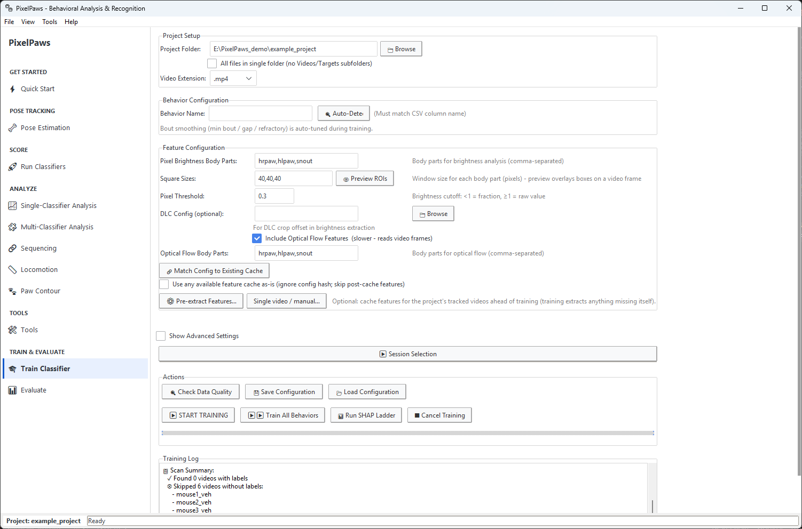
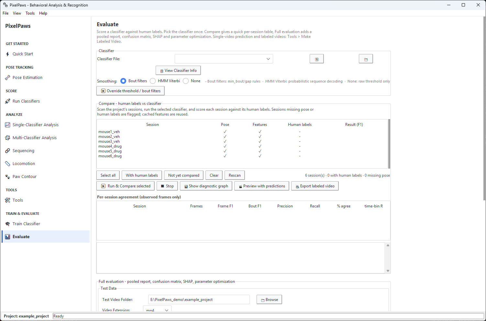

# Training your own classifiers

The classifiers that ship with PixelPaws score licking, scratching, facial grooming, body grooming, rearing, jumping, moving and stillness in video from the PixelPaws filming box. For another behavior, or for video from another setup, you label some video, train a classifier on it, and check it against your labels. This page covers that. Everything else is in the [PixelPaws guide](pixelpaws.md).

1. [Label CSVs](#label-csvs): the format PixelPaws trains on
2. [Labeling with BORIS](#labeling-with-boris)
3. [Train Classifier tab](#train-classifier-tab)
4. [Evaluate tab](#evaluate-tab)
5. [Crop for DLC tool](#crop-for-dlc-tool), for your own DeepLabCut projects

## Label CSVs

Labels are one row per frame and one column per behavior, 0 or 1:

```
frame,Lick,Groom
0,0,0
1,1,0
2,1,0
3,0,1
```

Mark frames you did not review as -1 (or leave them blank). Training skips them and evaluation ignores them.

Save label files in `behavior_labels/` as `<session>_labels.csv` (`session01_labels.csv` for `session01.mp4`). PixelPaws finds them when you train or evaluate.

Any tool that writes this format works. BORIS is the one we use (see [Labeling with BORIS](#labeling-with-boris)).

## Labeling with BORIS

[BORIS](https://www.boris.unito.it/) is a free tool for scoring behavior from video. PixelPaws reads its exports directly.

### Labeling in BORIS

1. Open the video in BORIS and make an ethogram with the behaviors you want to train (`Lick`, `Groom`).
2. Score each session with **START/STOP** events (continuous behaviors) or **POINT** events (instantaneous ones). Both work.
3. Export with **File → Export events → Save as CSV** (or TSV). The export needs at least these columns:
   - **Behavior**
   - **Behavior type** (`START`, `STOP` or `POINT`)
   - **Time** in seconds
   - **FPS** (optional)

### Converting BORIS labels

PixelPaws needs per-frame CSVs (one row per frame, one column per behavior, 0 or 1). Three ways to get there:

- **Automatic.** Drop the BORIS exports straight into `behavior_labels/`. When the Train tab scans sessions it recognizes raw BORIS files (by the `Behavior`, `Behavior type` and `Time` columns), offers to convert them (every behavior in the file), and moves the originals to `behavior_labels/boris_originals/`. It uses the export's FPS column, or 60 fps when there is none.
- **Tools tab → 🔄 BORIS to PixelPaws (CSV/TSV)**, one file (or a folder) at a time:
  1. Browse to the BORIS export.
  2. **Auto-Detect** the behaviors in the file and pick one, or type the name. Tick *All behaviors* to write every behavior as its own column.
  3. Check the **FPS**. The field starts at 60. Clear it to use the export's FPS column.
  4. Pick an output folder (defaults to the BORIS file's folder) and **Convert**.
- **Tools tab → 📥 Import BORIS Project (.boris)** reads a whole BORIS project. Pick the behaviors and observations, and it writes one label CSV per observation to `behavior_labels/`, named after its media file. Frames after each behavior's last event are marked -1 (not reviewed), and existing label files are merged.

The converter writes `<boris_filename>_labels.csv` with one column per behavior:

```
Lick
0
0
1
1
1
0
```

PixelPaws matches label files to videos by name, so name the export after the video or rename the output to `<video>_labels.csv`. Put it in `behavior_labels/` or next to the video. PixelPaws checks both. The session then shows up on the Train and Evaluate tabs.

### Tips

- **Frame alignment.** When the export has an *Image index* column the converter uses it directly. Otherwise it multiplies each timestamp by FPS and rounds, so enter the video file's exact frame rate or long recordings drift.
- **Unreviewed frames.** A converted file ends at the last event. Mark frames you did not review as -1 (or leave them blank): training skips them and evaluation ignores them. Sessions with very few labeled bouts still train the model but are not scored in cross-validation.

## Train Classifier tab

Builds a classifier for one behavior.



**Session discovery.** PixelPaws scans `videos/` and `behavior_labels/` for matching triplets: video, DLC H5, label CSV. **Scan Sessions** lists each labeled session with its video, ticked by default. Sessions without labels are listed in the Training Log. Untick any you want to leave out.

**Behavior name.** The exact column name from your label CSV (case-sensitive). Type it, or click **🔍 Auto-Detect** to pick from the columns in your label files. **Train All Behaviors** trains one classifier per behavior in the label files.

**Feature settings.**
- *Pose features*: pairwise distances, joint angles, velocities at several timescales, and whether each body part is tracked (DLC likelihood at least 0.8). Pose features always use every body part.
- *Brightness features*: pixel brightness in square ROIs around the body parts you pick, read from the video frames. Needs the video.
- *Optical flow features*: on by default (hrpaw, hlpaw, snout). They read the video, so extraction is slower.

**Pre-extract features** (optional). Training extracts and caches whatever features are missing, so you never have to do this first. To do it ahead of time, **⚙️ Pre-extract Features…** opens a window with the feature settings (brightness body parts, square sizes, pixel threshold, optical flow) and a **Sessions in project** table that marks each tracked video as cached, cached under other settings, or needing features. Uncached sessions are selected for you, and **▶ Extract selected** fills the gaps. **Single video / manual…** does one video and DLC file. Both are on the Tools tab too.

**Bout smoothing.** The threshold and the bout filters (min bout, min after bout, max gap) are tuned automatically during training to maximize F1, stored in the classifier and applied at prediction time.

**Advanced settings.** Tick **Show Advanced Settings** to see these:
- XGBoost: *Number of Trees* (default 1700), *Max Tree Depth* (default 6), *Learning Rate* (default 0.01), *Subsample Ratio* (default 0.8, fraction of rows per tree), *Feature Sampling* (colsample_bytree, default 0.2, fraction of features per tree)
- *Cross-validation folds*: 2 to 10 (default 5). Folds are split by session, so the reported scores reflect generalization to unseen sessions, not to neighboring frames. With one labeled session, cross-validation is skipped.
- *Early stopping*: on by default. Each fold stops adding trees when validation AUCPR has not improved for the set number of rounds (10 to 200, default 50). The final model uses the average best tree count.
- *Class imbalance*: `scale_pos_weight` is on by default. It up-weights the positive class so rare behaviors are not swamped by the majority class, without downsampling.
- *Trim to last labeled event*: on by default. Drops all frames after the last positive label in each session. This stops the unlabeled tail of a BORIS export from flooding training with false negatives.

**Run SHAP Ladder.** Optional: ranks features by SHAP, cross-validates at decreasing feature counts (by default from 600 down to 50 in steps of 50), and keeps the smallest set within 1% of the best F1. It saves the pruned model and an all-features model.

**Save / Load Configuration.** Saves the training settings to a JSON file for reuse or sharing.

**Start Training.** A progress window shows F1, precision and recall per fold and the honest cross-validated F1. Threshold curves, SHAP importance and the other plots are saved to the run's `plots/` folder.

Each classifier is saved in its own run folder under `classifiers/`, as `PixelPaws_<behavior>_<timestamp>.pkl` with a JSON sidecar, plots and the training data. The `.pkl` is stamped with the software version, code revision and library versions.

## Evaluate tab

Scores a classifier against human labels. Pick the classifier once at the top. Both halves of the tab use it.



**Classifier.** Pick from the `[Project]`, `[Global]` and `[Bundled]` entries or browse to any `.pkl`. **View Classifier Info** shows its behavior, threshold, minimum bout, calibration and any portability warnings. The threshold and bout filters (min bout, min after bout, max gap) come from the classifier. **Override threshold / bout filters** lets you try other operating points without retraining, and the Smoothing option picks bout filters, HMM Viterbi or none. Both apply to Compare and to Full evaluation.

**Compare** (quick, per session). The table lists the project's sessions and flags missing pose or labels. Sessions with both are selected. **Run & Compare** runs the classifier on the selected rows and reports per-session agreement on the labeled frames (frame F1, bout F1, precision, recall, % agreement, time-bin correlation). A diagnostic plot (raster, F1, time-bin correlation, probability trace) is saved for each session to `results/diagnostics/`. **Preview with predictions** and **Export labeled video** work on the selected session (the video styling is set in [Make Labeled Video](pixelpaws.md#make-labeled-video)).

**Full evaluation** (pooled report).
1. Set the **Test Video Folder** (the project by default) and click **Scan Test Sessions**. PixelPaws lists the labeled sessions it finds, matched the same way as training (video + H5 + labels).
2. Click **▶ RUN EVALUATION**. It evaluates every complete session in the folder and reports pooled results plus a per-session breakdown (turn off *Generate detailed per-video performance report* to skip the breakdown).

Results:
- Confusion matrix
- Precision, recall, F1 and accuracy at the classifier's threshold (or your override)
- Bout counts (labeled vs predicted) with bout precision, recall and F1
- Per-session diagnostic plots (raster, confusion, time-bin agreement, probability)

**🎯 Optimize Parameters** searches threshold and bout-filter values with cross-validation across the labeled sessions (each session is scored with values tuned on the others), then fills them into the override fields so the next run uses them. **💾 Save Params to Classifier** writes them into the `.pkl`. **🔬 SHAP Analysis** writes feature-importance plots to `evaluations/SHAP_<behavior>/`. Everything is saved to `evaluations/` as a text report, plots and per-session prediction CSVs.

## Crop for DLC tool

You may want to crop videos so DLC only sees the arena. The bundled pose network was trained on uncropped box video, so this is only for your own DLC projects.

**What it does:** encodes a new video (or a batch) containing only the pixels inside a rectangle, using FFmpeg (H.264, no audio).

**How to use it:**

1. **Tools → Crop Video for DLC…**
2. Pick a video, or a folder for batch mode.
3. Type X, Y, W and H (the defaults, X=286, Y=0, W=761, H=720, fit a common rig), or click **Preview & Select (OpenCV)**, drag a rectangle on a frame and press Enter.
4. Set **Quality (CRF)**: 18 to 40, default 23.
5. In batch mode each video opens a confirm dialog where you can adjust the rectangle, then *Crop this video*, *Skip* or *Cancel all*.
6. Tick *Save crop offsets to project config* to record the offsets in `PixelPaws_project.json`. PixelPaws reads crop offsets for brightness features from the DLC `config.yaml` you give in the DLC Config field, not from this file.

Cropped videos are saved next to the originals with a `_cropped` suffix. Run DLC on those, keep each cropped video next to its H5 in `videos/`, and name its labels after the cropped video (`<video>_cropped_labels.csv`).
