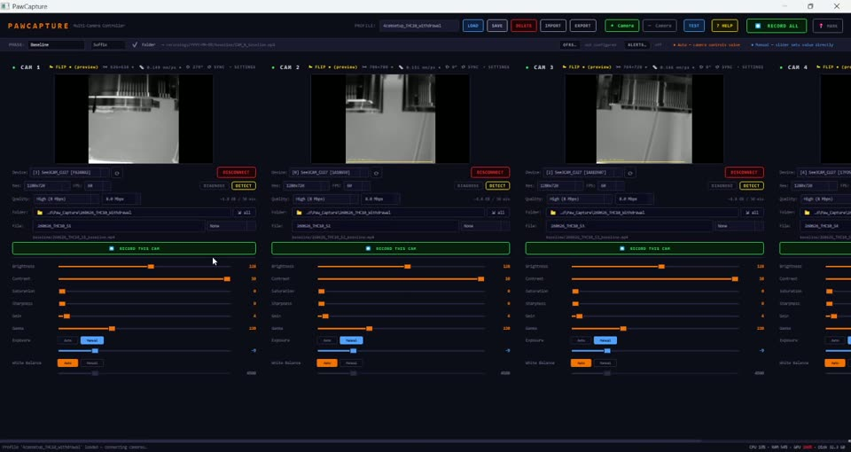

# PawCapture

The recording half of PixelPaws: runs several **See3CAM_CU27** USB cameras side by side (we
have tested up to four) and records each to its own hardware-encoded MP4 (GPU where available,
CPU fallback). Every file carries its mm/pixel calibration and phase tag, which PixelPaws
reads on its own, so Locomotion comes out in centimetres.

PawCapture is optional. PixelPaws takes video from any recording software. What you lose
without it is the calibration tag, so Locomotion reports pixels.

Version **0.8.0** · Windows 10/11 (64-bit) · no Python or FFmpeg install needed

The same walkthrough is in the app under **? HELP**. For PixelPaws itself, see the
[main page](../README.md) and the [PixelPaws guide](../docs/pixelpaws.md).

---

## Requirements

- **Windows 10 or 11**, 64-bit
- **One or more See3CAM_CU27** USB cameras (see [`docs/hardware.md`](../docs/hardware.md) for the rig).
  We have tested up to 4. **+ Camera** adds more panels, and the limit is your computer.
  - Use **USB 3.0** ports. For 4 cameras, spread them across separate USB controllers/hubs
    if you can. Four 1080p streams is a lot of bus bandwidth.
  - Dropped frames with several cameras almost always mean they share one USB controller. Do not
    chain cameras through an unpowered hub, and keep it to one camera per powered hub. In
    **Device Manager → Universal Serial Bus controllers** you can see which root hub each
    camera is on. A desktop can add a PCIe USB 3 card with one controller per port.
- An **SSD** to record to, and 16 GB of RAM or more for four cameras.
- A GPU with NVENC / QSV / AMF is used automatically for encoding when present; otherwise it
  falls back to CPU (x264).

---

## Install

Download **[PawCapture-0.8.0_win64.zip](https://github.com/rslivicki/PixelPaws/releases/download/v0.9.0/PawCapture-0.8.0_win64.zip)**
from the PixelPaws [Releases page](https://github.com/rslivicki/PixelPaws/releases), next to
the PixelPaws installer. Nothing else to install. FFmpeg and the Python runtime are bundled.

1. Right-click **`PawCapture-0.8.0_win64.zip`** and choose **Extract All** (anywhere is fine, the desktop too).
2. Open the extracted `PawCapture` folder and run **`PawCapture.exe`**. If Windows says "Windows protected your PC",
   click **More info**, then **Run anyway** (PawCapture is not code-signed).

It is portable: the whole app lives in that folder, and updating means replacing the folder.
(A Start-menu installer can be built with Inno Setup; see Building from source.)

---

## Video walkthrough

[](https://youtu.be/XVCIXMrne3o)

A 6-minute narrated screen recording on the acquisition PC, [on YouTube](https://youtu.be/XVCIXMrne3o)
(click the picture to watch, or a time below to jump there). It was recorded in July 2026 on
an earlier build; the layout is the same.

| Time | Covers |
|---|---|
| [0:00](https://youtu.be/XVCIXMrne3o?t=0) | Opening PawCapture; one preview per camera (add more with **+ Camera**, limited by the GPU and CPU) |
| [0:28](https://youtu.be/XVCIXMrne3o?t=28) | Profiles: saved settings, save folders, and which camera is CAM 1 to 4 |
| [0:58](https://youtu.be/XVCIXMrne3o?t=58) | The camera panel: flip, crop, calibration, rotate, and the device list |
| [1:32](https://youtu.be/XVCIXMrne3o?t=92) | Resolution, frame rate, quality, and the disk-space estimate |
| [1:49](https://youtu.be/XVCIXMrne3o?t=109) | Output folder (**⇲ all**), file names, prefix or suffix, and phases |
| [2:36](https://youtu.be/XVCIXMrne3o?t=156) | Connecting a camera and cropping it to the box |
| [3:01](https://youtu.be/XVCIXMrne3o?t=181) | Calibrating against a ruler |
| [3:39](https://youtu.be/XVCIXMrne3o?t=219) | Exposure, contrast, saturation and gain |
| [3:54](https://youtu.be/XVCIXMrne3o?t=234) | Loading a four-camera profile; baseline, post-drug and custom phases |
| [4:38](https://youtu.be/XVCIXMrne3o?t=278) | Recording one camera or all of them, and the file-already-exists warning |
| [5:15](https://youtu.be/XVCIXMrne3o?t=315) | Where the recordings land |

---

## Walkthrough

### Quick start

1. Plug in the cameras, then start PawCapture.
2. In each camera panel, pick the device from the **Device** dropdown and click **CONNECT**.
   The dropdown labels cameras by serial; each label opens that exact camera. The preview
   should appear.
3. (Optional) Set crop, flip or rotation to frame the behavior box.
4. **Calibrate** each camera with **📏 CAL** against a ruler in the scene (see
   [Calibration](#calibration-mm-per-pixel) below).
5. (Optional) Click **TEST** to check that every camera can write a 2-second file.
6. Set the **Folder** and **File** name per camera (or set one camera's folder and click
   **⇲ all** to apply it to every camera).
7. Pick a **Phase** (Baseline / Post-Drug / …) in the top bar if you want phase-tagged
   filenames and subfolders.
8. Click **SAVE** in the top bar to keep this setup as a profile, so you don't redo it next session.
9. Click **⏺ RECORD ALL** (or record per camera) to start, **STOP ALL** to end.

Recordings are saved under **`%USERPROFILE%\PawCapture\recordings\YYYY-MM-DD\`** by default,
each session with a `session_*.json` manifest alongside the videos. Drop the MP4s into a
PixelPaws project's `videos/` folder (or add them from the Quick Start tab); the intake
transcode keeps the calibration tags.

### Keyboard shortcuts

| Key | Does |
|---|---|
| `Space` | Toggle RECORD ALL |
| `M` | Drop a sync marker (only while recording) |

Shortcuts are skipped while a text box has focus.

### Camera panel buttons

| Button | Does |
|---|---|
| **⇆ FLIP** | Horizontal mirror, preview only. Recording is unaffected. |
| **✂ CROP** | Drag a rectangle on the source frame. Recording uses the cropped pixels, and the button shows the cropped size. |
| **📏 CAL** | Calibrate mm per pixel against something of known length. |
| **↻ 0°** | Rotate the preview 90° clockwise per click. |
| **↺ SYNC** | Re-read the current camera property values from the hardware. |
| **▾ SETTINGS** | Show or hide the slider panel (exposure, gain and so on). |

The sliders (brightness, contrast, saturation, sharpness, gain, gamma, exposure, white balance)
are set per camera. In our boxes contrast is high and saturation and gain are low; whatever works
for your lighting, save it in a profile.

### Calibration (mm per pixel)

Each camera gets its own calibration because the lens is varifocal: every camera's zoom-ring
position changes its field of view. Without it, PixelPaws can't convert paw measurements in
pixels to millimetres, and Locomotion reports pixels instead of centimetres.

**How to calibrate**
1. Put a ruler (or anything you know the real length of) inside the camera's view, on the arena floor.
2. Click **📏 CAL**. A window opens with a snapshot of the current preview.
3. Click one end of the ruler, then the other. A yellow line and dots show your selection.
4. Type the real length in **Reference length (mm)**.
5. Optionally type the camera-to-subject distance in **Working distance** (stored as metadata only).
6. Click **OK**. The button changes to something like **📏 0.148 mm/px ●**, and a 100 mm scale
   bar appears on the bottom left of the preview, so a wrong calibration is obvious before you record.

**When to recalibrate**
- You moved the camera or changed its height.
- You turned the zoom or focus ring on the lens.
- You changed the recording resolution.

Crop, flip and 90°/180°/270° rotation do not change the calibration, since the pixel density
stays the same.

**Where it goes**
- Saved with the profile.
- Written into every MP4 recorded after calibration, as container metadata.
- Copied into each session manifest.

### Recording

- Defaults: 1280x720, 60 fps, **High (8 Mbps)**. Next to the quality setting each panel shows
  how much disk 30 minutes of recording takes (about 1.8 GB at the defaults), so check there is
  room for every camera before a long session.
- The output frame rate is whatever you set in the **FPS** dropdown, enforced by FFmpeg
  regardless of camera clock drift.
- Encoder: NVENC, then QSV, then AMF, then libx264, picked once at startup. The record button
  shows which one is in use.
- Default output folder: `%USERPROFILE%\PawCapture\recordings\`, grouped by day
  (`recordings\YYYY-MM-DD\`). Override it per camera in the panel.
- **Phase** (top bar) tags a session as baseline, post-drug, antagonist or a custom name. Files
  then go into `recordings\YYYY-MM-DD\<phase>\` and the tag is added to the filename as a prefix or suffix.
- Default filename: `CAM_N_YYYYMMDD_HHMMSS.mp4`. The suffix format is set per camera.
- Before RECORD ALL starts, free space on each output drive is checked. You're warned if there's
  less than about 1 GB per active camera.
- Existing files are never overwritten. If a target file already exists, recording is refused
  with a message. Change the File name, the suffix or the phase and try again.
- **If FFmpeg crashes mid-recording**, that camera reopens and keeps recording into
  `<name>_pt2.mp4` (then `_pt3` and so on) beside the first file, which stays playable up to the
  crash. The panel shows **⚠ REC pt2** and the status bar says when it happened. The session
  manifest keeps `file` as the first part and lists every part under `file_parts`. If FFmpeg
  crashes three times in a row within 15 s of starting, PawCapture stops retrying and shows an error.

### TEST

A 2-second dry recording on every connected camera. It checks that each output file is written
and readable, so a misconfigured camera shows up before a long session.

### 📍 MARK (sync markers)

Enabled only while RECORD ALL is running. Drops a timestamped marker (with an optional label)
into the session manifest at the current recording time. Same as pressing `M`.

### OFRS pairing (RWD photometry)

Click **OFRS…** in the legend bar to set RWD-FPsystem's data folder (usually
`D:\RWD-OFRS\RWD-Data`) and turn on auto-pair. With auto-pair on, PawCapture notes the existing
OFRS session folders when RECORD ALL starts and, on stop, finds any new one created during the
recording. Its `Events.csv` events are aligned to the PawCapture timeline and added as marks, and
the OFRS session details go into the manifest under `ofrs_sessions`.

### Session manifest

Every RECORD ALL session writes `session_YYYYMMDD_HHMMSS.json` next to the recordings (in the day
folder) with the schema version (`pawcapture.session/v1`), the PawCapture version, each camera's
files, calibration, resolution, fps, crop and encoder, the sync marks, the profile name, the
machine label, and the start and end times. PixelPaws reads it through `pawcapture_meta.py`
(`read_session_manifest`, `find_session_for_video`).

### MP4 calibration tags (for PixelPaws)

When a camera is calibrated, these tags are written into the recorded MP4:

| Tag | Meaning |
|---|---|
| `mm_per_pixel` | mm in the world per pixel in the recording (the main one) |
| `working_distance_mm` | camera-to-subject distance, if you typed it |
| `pixelpaws_calibrated` | `"1"`; absent on uncalibrated files |
| `pixelpaws_ref_length_mm` | the real length you typed at calibration |
| `pixelpaws_ref_pixels` | the pixel distance between your two clicks |

Read them with `ffprobe -v 0 -show_entries format_tags -of json file.mp4`, or from Python:

```python
from pawcapture_meta import read_calibration, read_session_manifest
cal = read_calibration("CAM_1.mp4")          # dict, or None if uncalibrated
sess = read_session_manifest("session_20260918_101500.json")
```

PyAV, MediaInfo, MP4Box, mutagen and VLC (Media Information → Metadata) also show them.
OpenCV's `VideoCapture` does not.

### Profiles

A profile stores every panel's settings: device, resolution and fps, crop, flip and rotation,
slider values, output folder, filename, suffix format and calibration. Because it stores which
physical camera each panel opens, CAM 1 to 4 stay in the same left-to-right order every
session, so keep one profile per filming box.

- **SAVE**: if a profile is loaded, you're asked whether to overwrite it or save under a new name.
- **LOAD**: applies the selected profile and connects the cameras one at a time.
- **DELETE**: removes the profile file.
- **EXPORT** / **IMPORT**: write a profile to any path, or copy one in from another rig. Importing
  doesn't load it; pick it from the list and click LOAD.

Profiles live in `%USERPROFILE%\PawCapture\profiles\`.

### Hardware notes (See3CAM_CU27 + CB-2812-3MP lens)

- Native modes: MJPEG up to 100 fps, UYVY up to 60 fps. OpenCV always reports 30 fps for this
  camera; FFmpeg gets the real rate.
- The lens is a 2.8 to 12 mm varifocal CS-mount. Zoom position differs per camera, so each needs
  its own calibration.
- The wide end (2.8 mm) has visible barrel distortion, so the pixel scale is least accurate near
  the frame edges.

### Troubleshooting

| Symptom | What to do |
|---|---|
| No preview after CONNECT | Click ⟳ next to the device list to re-scan. Make sure no other app (OBS, Camera and so on) has the camera open, and that each panel points at a different camera. |
| Tiled or scrambled image | Unplug and replug that camera's USB cable to reset its image processor, then reconnect. Don't run two copies of PawCapture against the same camera. |
| FPS shows "~50 fps measured" | The camera is really under-delivering, usually auto-exposure in low light. Lower the exposure by hand or add light. |
| Sliders don't change the image | The camera reconnected mid-session. Click ↺ SYNC, or disconnect and connect. |
| Recording is smaller than set | A crop is set; the ✂ CROP button shows its size. |
| MP4 has no calibration tags | The camera wasn't calibrated before recording, or an old profile overwrote the calibration. Recalibrate and record again. |
| A recording has `_pt2` files | FFmpeg crashed during that recording and PawCapture resumed it. The parts are in order; all of them are listed in the session manifest. |

Logs are written to `%USERPROFILE%\PawCapture\logs\` (including `crash.log` if the app ever exits
unexpectedly). Attach them when reporting a problem.

---

## Building from source

```
cd pawcapture
build.bat            (add --clean to start from scratch)
```

`build.bat` needs Python 3.10+ (python.org, "Add to PATH") and internet on the first run: it
installs `requirements.txt`, downloads the FFmpeg release-essentials build into `ffmpeg\`,
runs PyInstaller (`PawCapture.spec`) and writes `dist\PawCapture\` plus the portable zip.
If [Inno Setup 6](https://jrsoftware.org/isdl.php) is installed it also builds
`installer_output\PawCapture_Setup_v<ver>.exe`. To run from source instead:
`pip install -r requirements.txt` then `python pawcapture_app.py` (needs `ffmpeg.exe` on PATH
or in `pawcapture\ffmpeg\`).

`pawcapture_meta.py` is the stdlib-only reader PixelPaws uses for the calibration tags and
session manifests; the copy at the PixelPaws root is the same file.

The crash auto-resume has a camera-free test (a fake FFmpeg that crashes on cue):
`python -m pytest tests/pawcapture -q` from the PixelPaws root, in an environment with PyQt5.
